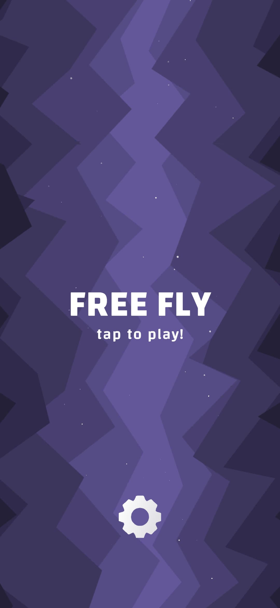
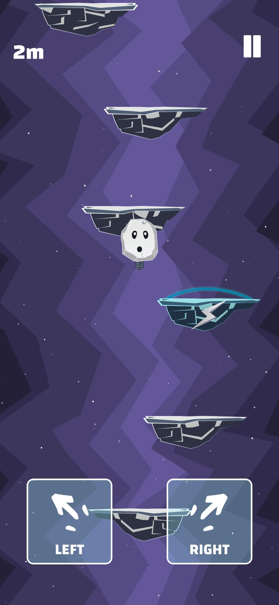
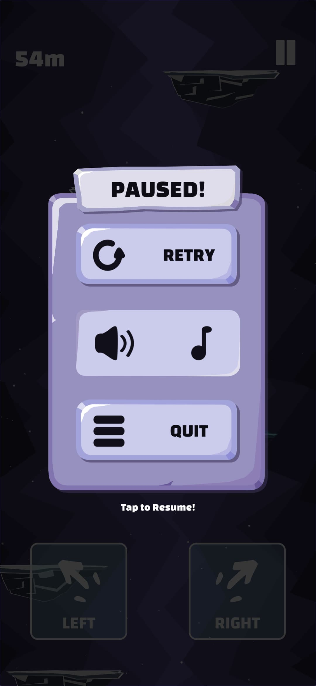
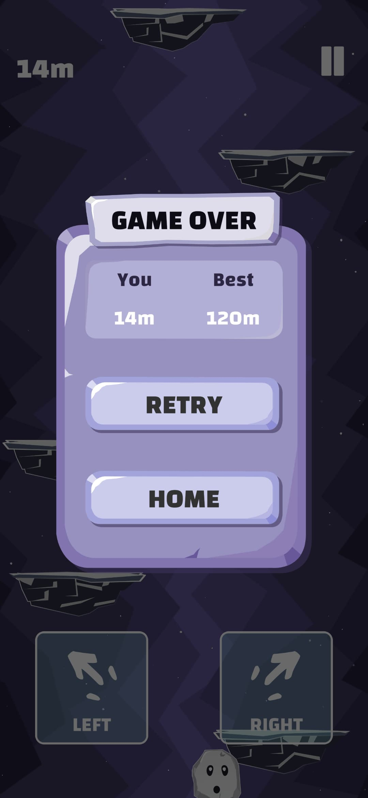
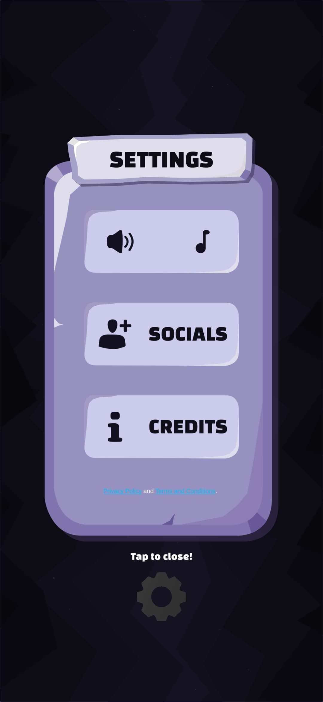

# Free Fly

Free Fly is a **mobile game** inspired by (https://github.com/JetLightStudio/Rocket_Ride_Unity3D) and revamped with new features, mechanics, and a unique twist.
The game plays in a style similar to **Doodle Jump** — your character climbs upward by bouncing on platforms while avoiding obstacles and collecting rewards.

  ## 🔹 Screenshots

## 🕹 Gameplay

* **Controls:**
  Players control their character using **on-screen left and right arrows or buttons**.

* **Objective:**
  The main objective is to reach as high as possible while avoiding falling.

* **Features:**

  * Endless upward gameplay — the higher you go, the higher your score.

## 🔹 Tools & Technology

* **Unity 3D** (2021.x or newer)
* C#
* Unity UI for controls
* 2D game assets and sprites

## 🔹 Installation (Developer)

1. **Clone or download** the repository.
2. Open the project in **Unity 2021.x or newer**.
3. Hit **Play** in the Unity editor to preview or debug the game.

## 🔹 Contributing

Contributions are welcome!
If you'd like to improve Free Fly or add a new feature, please:

1. Fork the repository.
2. Create a new branch.
3. Implement your change.
4. Submit a Pull Request.

## 🔹 License

Free Fly is distributed under the [MIT license](LICENSE).
